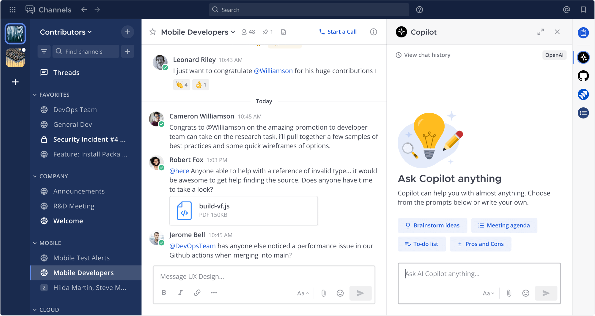

<div align="center">

# Mattermost Copilot Plugin [](https://github.com/mattermost/mattermost-plugin-ai/releases/tag/latest-master)

The Mattermost Copilot Plugin integrates AI capabilities directly into your [Mattermost](https://github.com/mattermost/mattermost) workspace, supporting both self-hosted and vendor-hosted Large Language Models (LLMs).

</div>



## Installation

1. Download the latest release from the [releases page](https://github.com/mattermost/mattermost-plugin-ai/releases). You can also download the **experimental** [latest master](https://github.com/mattermost/mattermost-plugin-ai/releases/tag/latest-master)
2. Upload and enable the plugin through the Mattermost System Console
3. Configure your desired LLM provider settings

More details on the [Mattermost documentation site](https://docs.mattermost.com/configure/enable-copilot.html)

### System Requirements

- Mattermost Server versions:
  - v10.0 or later recommended
  - v9.11+ (ESR)
- PostgreSQL database
- Network access to your chosen LLM provider

## Configuration

After installation, you'll need to configure the plugin through the System Console:

1. Navigate to **System Console > Plugins > Copilot**
2. Create a bot
3. Select and setup an upstream provider
4. Check it's working in the copilot RHS

For detailed configuration instructions, see the [Mattermost Product Documentation](https://docs.mattermost.com/configure/enable-copilot.html#mattermost-configuration).

## Development

### Prerequisites

- Go 1.22+
- Node.js 20.11+
- Access to an LLM provider (OpenAI, Anthropic, etc.)

### Local Setup

1. Setup your Mattermost development environment by following the [Mattermost developer setup guide](https://developers.mattermost.com/contribute/server/developer-setup/). If you have a remote mattermost server you want to develop to you can skip this step. 

2. Setup your Mattermost plugin development environment by following the [Plugin Developer setup guide](https://developers.mattermost.com/integrate/plugins/developer-setup/).

3. Clone the repository:
```bash
git clone https://github.com/mattermost/mattermost-plugin-ai.git
cd mattermost-plugin-ai
```

4. **Optional**. If you are developing to a remote server, setup environment variables to deploy:
```bash
MM_SERVICESETTINGS_SITEURL=http://localhost:8065
MM_ADMIN_USERNAME=<YOUR_USERNAME>
MM_ADMIN_PASSWORD=<YOUR_PASSWORD>
```

5. Run deploy to build the plugin
```bash
make deploy
```

### Other make commands

- Run `make help` for a list of all make commands
- Run `make check-style` to verify code style
- Run `make test` to run the test suite
- Run `make e2e` to run the e2e tests


## License

This repository is licensed under [Apache-2](./LICENSE), except for the [server/enterprise](server/enterprise) directory which is licensed under the [Mattermost Source Available License](LICENSE.enterprise). See [Mattermost Source Available License](https://docs.mattermost.com/overview/faq.html#mattermost-source-available-license) to learn more.
